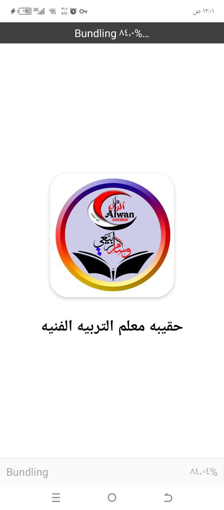

# Art Teacher's Toolkit 🎨

An educational mobile application for elementary art education based on modern curriculum requirements - Educational Development Study


## 📖 Overview

Art Teacher's Toolkit is an educational application specifically designed for art teachers in elementary education. The app provides comprehensive, organized educational content according to the latest pedagogical methods.

### Research by
**Wesam Abdul Sattar Al-Rabie**  
Master's in Art Education Teaching Methods  
Senior Art Supervisor

## ✨ Key Features

- 📚 **Four Comprehensive Chapters** covering all aspects of art education
- 🔍 **Advanced Search** to find content easily
- 🌙 **Dark/Light Mode Support** for eye comfort
- � **Customizable Font Sizes** (Small, Medium, Large)
- 📱 **Responsive Design** works on all screen sizes
- 🔄 **Reading Progress Tracking**
- 📖 **Offline Reading** capability
- 🎨 **Interactive Art Lessons**

## 📱 Screenshots




## 🚀 Getting Started

This is an [Expo](https://expo.dev) project created with [`create-expo-app`](https://www.npmjs.com/package/create-expo-app).

### Prerequisites

- Node.js (version 14 or higher)
- npm or yarn
- Expo CLI

### Installation

1. **Clone the repository**
   ```bash
   git clone https://github.com/your-username/book-art.git
   cd book-art
   ```

2. **Install dependencies**
   ```bash
   npm install
   ```

3. **Start the development server**
   ```bash
   npx expo start
   ```

4. **Run on device/emulator**
   
   In the output, you'll find options to open the app in:
   - [development build](https://docs.expo.dev/develop/development-builds/introduction/)
   - [Android emulator](https://docs.expo.dev/workflow/android-studio-emulator/)
   - [iOS simulator](https://docs.expo.dev/workflow/ios-simulator/)
   - [Expo Go](https://expo.dev/go)

## 📁 Project Structure

```
book-art/
├── app/                    # Main application screens
├── assets/                 # Images, fonts, and other assets
│   ├── images/            # App images and icons
│   ├── read_me/           # README screenshots
│   └── fonts/             # Custom fonts
├── components/            # Reusable UI components
├── constants/             # App constants and configurations
├── data/                  # Book content and data files
└── hooks/                 # Custom React hooks
```

## 🛠️ Built With

- **React Native** - Mobile app framework
- **Expo** - Development platform
- **TypeScript** - Programming language
- **React Navigation** - Navigation library
- **AsyncStorage** - Local data storage

## 📚 App Content

### Chapter 1: Fundamentals of Art Education
- Basic art concepts
- Teaching methodologies
- Student assessment techniques

### Chapter 2: Practical Art Techniques
- Drawing fundamentals
- Color theory
- Composition principles

### Chapter 3: Classroom Management
- Art classroom setup
- Material organization
- Safety guidelines

### Chapter 4: Advanced Teaching Strategies
- Creative project ideas
- Portfolio development
- Exhibition planning

## 🎨 Features in Detail

### Theme Support
- **Light Mode**: Clean, bright interface for daytime use
- **Dark Mode**: Eye-friendly dark theme for low-light environments

### Font Customization
- **Small**: For detailed reading
- **Medium**: Standard comfortable reading
- **Large**: Enhanced accessibility

### Search Functionality
- Global search across all chapters
- Quick content filtering
- Bookmarking favorite sections

## 🤝 Contributing

We welcome contributions to improve the Art Teacher's Toolkit! Please follow these steps:

1. Fork the repository
2. Create a feature branch (`git checkout -b feature/AmazingFeature`)
3. Commit your changes (`git commit -m 'Add some AmazingFeature'`)
4. Push to the branch (`git push origin feature/AmazingFeature`)
5. Open a Pull Request

## 📄 License

This project is licensed under the MIT License - see the [LICENSE](LICENSE) file for details.

## 📞 Contact

**Wesam Abdul Sattar Al-Rabie**  
- Email: wesam.alrabie@example.com
- LinkedIn: [linkedin.com/in/wesam-alrabie](https://linkedin.com/in/wesam-alrabie)

## 🙏 Acknowledgments

- Ministry of Education for curriculum guidelines
- Elementary art teachers for valuable feedback
- Expo team for the excellent development platform
- React Native community for continuous support

---

**Download the app and enhance your art teaching experience!** 🎨📱